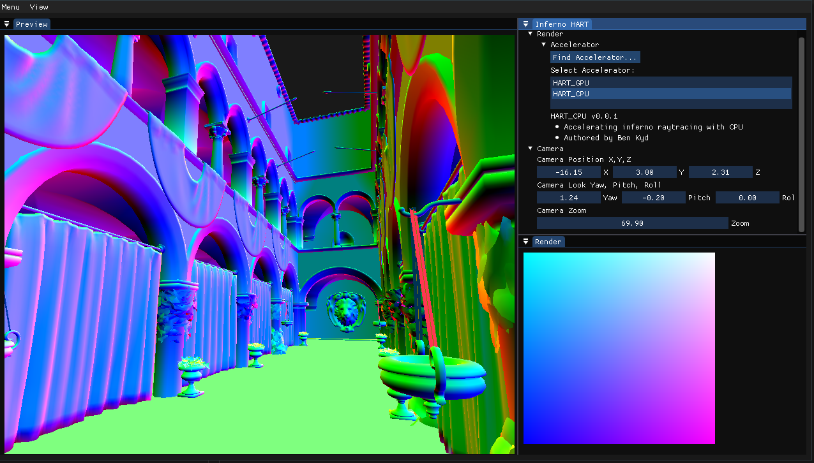

Inferno HART (Hardware Accelerated RayTracing) will revolutionise the way we write application-specific raytracing applications with a clear and distinct abstraction between the core renderer, Inferno and the HART layer.

Seperating Inferno and HART allows us to create the HART which can implement an accelerator for the ray-triangle intersection. Allowing for custom RayTracing silicon to be utilised WITHOUT changing the code code, nor the Global Illumination code, which can be also run on anything.

This combined with it's full functionality through Julia makes Inferno HART a very expansible and sleek pathtracing engine.

## Features

## Building

Create a build directory `inferno-hart/build/`

### Windows

Install [VCPKG](https://vcpkg.io/en/getting-started.html)
- Install OpenGL
- Install GLFW3

`cd build`

Set up compiler with `cmake .. "-DCMAKE_TOOLCHAIN_FILE=[path to vcpkg]/scripts/buildsystems/vcpkg.cmake" -G "VS Version"`

Compile with `cmake --build . --config Release/Debug/RelDebInfo`

## Linux (x64)

Install GLFW3 via your favorite package manager

`cd build`

Set up compiler with `cmake ..`

compile with `make -j[threads]`

## Technologies

- OpenGL, utilised with GLAD and GLFW
- ImGui for lovely GUI
- YOLO for lovely logging

## Acknowledgements
